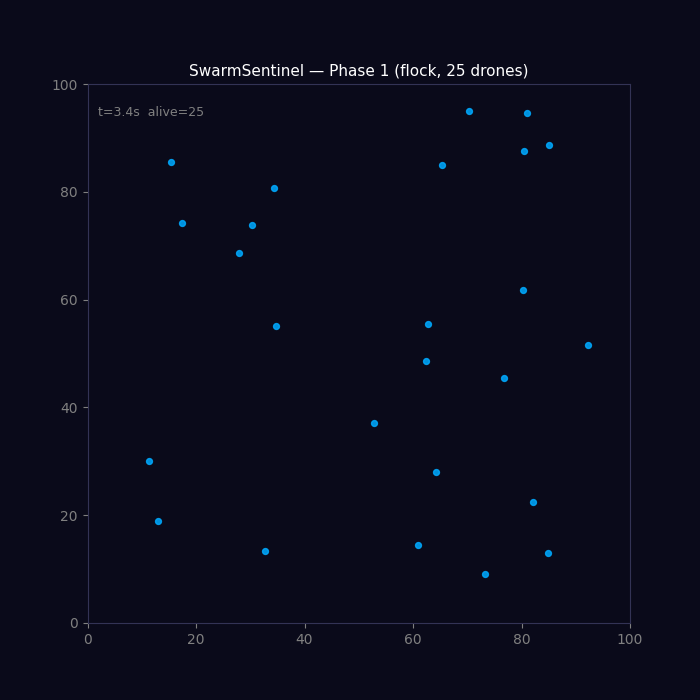

# SwarmSentinel 🛡️

> Real-time multi-sensor fusion and autonomous swarm threat classification system.

[]()
[]()
[]()

---

## What This Is

SwarmSentinel is a software system that ingests simulated radar, optical, and RF sensor streams, fuses them into a unified real-time operational picture, and classifies incoming drone threats — including coordinated swarm attacks — using a trained PyTorch model.

It is designed to demonstrate the core architecture of a production counter-drone C2 (Command and Control) system, without physical hardware.

**Why this matters:** Modern counter-drone defense is a pile of sensors and systems that don't talk to each other. This project builds the software stack that connects them — sensor fusion at the bottom, AI threat classification in the middle, and an operator dashboard at the top.

---

## Architecture

```
┌─────────────────────────────────────────────┐
│              C2 Dashboard (React)            │  ← Operators act here
├─────────────────────────────────────────────┤
│           FastAPI Backend + Kafka            │  ← Real-time data bus
├─────────────────────────────────────────────┤
│        Swarm Classification (PyTorch)        │  ← AI threat decisions
├─────────────────────────────────────────────┤
│     Sensor Fusion (Kalman / EKF)             │  ← Fused track output
├─────────────────────────────────────────────┤
│  Radar Sim │ Optical Sim │ RF Sim            │  ← Noisy sensor inputs
├─────────────────────────────────────────────┤
│         Swarm Physics Simulator              │  ← Ground truth
└─────────────────────────────────────────────┘
```

---

## Phase 1 Demo



*25 drones, flock behavior, 15 fps. Boids rules (separation, alignment, cohesion) with boundary repulsion keep the swarm loosely centred across the canvas.*

---

## Running the Simulation

```bash
# Install dependencies (numpy + matplotlib are the only Phase 1 requirements)
pip install numpy matplotlib

# Random walk — disorganised, baseline
python simulator/run_simulation.py --behavior random

# Flocking — Reynolds Boids, drones self-organise into moving clusters
python simulator/run_simulation.py --behavior flock

# Attack — all drones converge on canvas centre [50, 50]
python simulator/run_simulation.py --behavior attack

# Save a GIF instead of opening a window
python simulator/run_simulation.py --behavior flock --save assets/my_run.gif
```

---

## Sensor Models

**Radar** (`sensors/radar.py`) — returns an `(n_detected, 4)` array of `[x, y, vx, vy]` measurements per alive drone. Position noise is Gaussian (σ = 1.0 m) and velocity noise is Gaussian (σ = 0.3 m/s). Each detection is independently dropped with probability 0.05, simulating a realistic miss rate.

**Optical** (`sensors/optical.py`) — returns a list of bounding-box dicts `{drone_id, bbox: [x, y, w, h], confidence}`. Drone positions are perturbed by Gaussian noise (σ = 2.0 m) before the box is centred on them. True detections are dropped with probability 0.10; false-positive boxes are added at a rate of Binomial(n\_alive, 0.10) per frame, placed uniformly across the canvas. False positives carry `drone_id = None` and lower confidence scores (0.1–0.5). OpticalSensor defaults to the swarm arena size (100×100) and clips all bounding boxes to arena bounds.

**RF** (`sensors/rf.py`) — returns an `(n_alive,)` array of signal-strength readings. The physical model is `signal = max_signal / distance_to_origin²` with additive Gaussian noise (σ = 0.5). Each reading is independently zeroed with probability 0.15 to simulate transmitter dropout. Signals for distant drones can go slightly negative (noise floor effect — intentional).

---

## Phase 3 — Swarm AI Classifier

### Architecture

```
Input: (batch, 20 timesteps, 8 features)
  └─ LSTM(input=8, hidden=64, layers=2, dropout=0.3)
       └─ last hidden state (batch, 64)
            └─ Linear(64→32) → ReLU → Dropout(0.3) → Linear(32→3)
Output: logits (batch, 3)  →  softmax  →  class probabilities
```

**53,379 parameters.** Training: 1,500 synthetic samples (500/class), 50 epochs, Adam lr=1e-3.

### Input Features (per timestep)

| # | Feature | Description |
|---|---------|-------------|
| 0–1 | `centroid_x/y` | Mean position of radar-detected drones (m) |
| 2–3 | `centroid_vx/vy` | Mean velocity of radar-detected drones (m/s) |
| 4–5 | `spread_x/y` | Std of drone positions — 0 for individual, >20 for swarms |
| 6 | `n_alive_norm` | Active drone count / 25 — ≈0.04 individual, ≈0.96 swarm |
| 7 | `mean_speed` | Mean per-drone speed (m/s) |

### Classification Results (held-out test set, 600 samples)

| Class | Precision | Recall | F1 |
|-------|-----------|--------|----|
| individual | 1.000 | 1.000 | **1.000** |
| swarm | 0.915 | 0.650 | **0.760** |
| attack | 0.729 | 0.940 | **0.821** |
| **macro avg** | 0.881 | 0.863 | **0.860** |

**Overall accuracy: 86.3%** — exceeds the 85% Phase 3 target.

The individual class is classified perfectly (`spread=0` and `n_alive_norm≈0.04` are unambiguous). Swarm/attack confusion is concentrated in early-stage attack sequences where the convergence pattern hasn't yet separated from flocking motion within the 1.3-second observation window.

### Phase 3 Modules

| File | Description |
|------|-------------|
| `ml/dataset.py` | Synthetic 3-class trajectory dataset generator |
| `ml/model.py` | `SwarmClassifier` LSTM architecture |
| `ml/train.py` | Training loop (50 epochs, Adam, 80/20 split) |
| `ml/evaluate.py` | Evaluation: accuracy, per-class F1, confusion matrix |
| `ml/predictor.py` | Physics-based trajectory predictor (linear extrapolation, horizon=10) |
| `ml/threat_ranker.py` | Threat scorer: `0.5·attack_prob + 0.3·speed + 0.2·proximity` |
| `ml/MODEL_CARD.md` | Full model card with limitations and intended use |

---

## Project Phases

| Phase | Focus | Status |
|-------|-------|--------|
| Phase 1 (Wk 1–6) | Swarm Simulator + Sensor Models | ✅ Complete |
| Phase 2 (Wk 7–12) | Kalman Filter Sensor Fusion | ✅ Complete |
| Phase 3 (Wk 13–20) | PyTorch Swarm Classification | ✅ Complete |
| Phase 4 (Wk 21–28) | HPC Layer + Kafka + C2 Dashboard | ⏳ Planned |

---

## Tech Stack

| Component | Technology |
|-----------|-----------|
| Simulation | Python, NumPy |
| Sensor Fusion | FilterPy (Kalman Filters) |
| ML Model | PyTorch |
| Data Pipeline | Apache Kafka |
| API | FastAPI |
| Frontend | React |
| HPC Layer | MPI (mpi4py) |
| Infrastructure | Docker, Docker Compose |
| Docs | MkDocs |

---

## Repository Structure

```
SwarmSentinel/
├── simulator/        # Swarm physics engine (Drone, Swarm, Boids behaviors)
├── sensors/          # Radar, optical, RF sensor models
├── fusion/           # Kalman filter + EKF pipeline, TrackManager
├── ml/               # Phase 3: LSTM classifier, predictor, threat ranker
├── benchmarks/       # Fusion RMSE benchmarks (sensor count comparison)
├── assets/           # Demo GIFs
├── docs/             # Project documentation
└── tests/            # Environment check and CLI smoke tests
```

---

## Quickstart (Phase 1)

```bash
git clone https://github.com/YOUR_USERNAME/SwarmSentinel
cd SwarmSentinel
pip install -r requirements.txt
python simulator/run_simulation.py
```

---

## Known Issues

- **Benchmark compares 1/2/3 sensor configs, not KF vs EKF.** Config 1: radar only; Config 2: radar + optical; Config 3: radar + optical + RF. RF carries no position information — in Config 3, `TrackManager` uses `rf_arr.size` (total channel count = n\_alive) as a spawn cap to prevent ghost tracks without the systematic under-count that positive-signal counting would cause.
- **EKF is implemented but not the default run path.** `TrackManager` uses `DroneKalmanFilter` (4-state CV) by default. Pass `--ekf` to `run_fusion.py`, or `use_ekf=True` to `FusionPipeline` / `TrackManager`, to enable the 5-state CTR `DroneEKF`.
- **Detailed Phase 1 completion state:** see [`docs/PHASE1_CHECKLIST.md`](docs/PHASE1_CHECKLIST.md).

---

## Target Companies

This project is built as a portfolio piece targeting roles at:
- **Helsing** (Munich) — AI for defense systems
- **Fraunhofer IOSB** — sensor fusion research
- **LRZ** — HPC systems
- **DLR** — autonomous systems research
- **DroneShield / Dedrone** — commercial counter-drone

---

## Author

Bhuvanesh | MSc High Performance Computing & Quantum Computing  
Deggendorf Institute of Technology, Bavaria, Germany  
Background: Mechanical Engineering + Robotics
